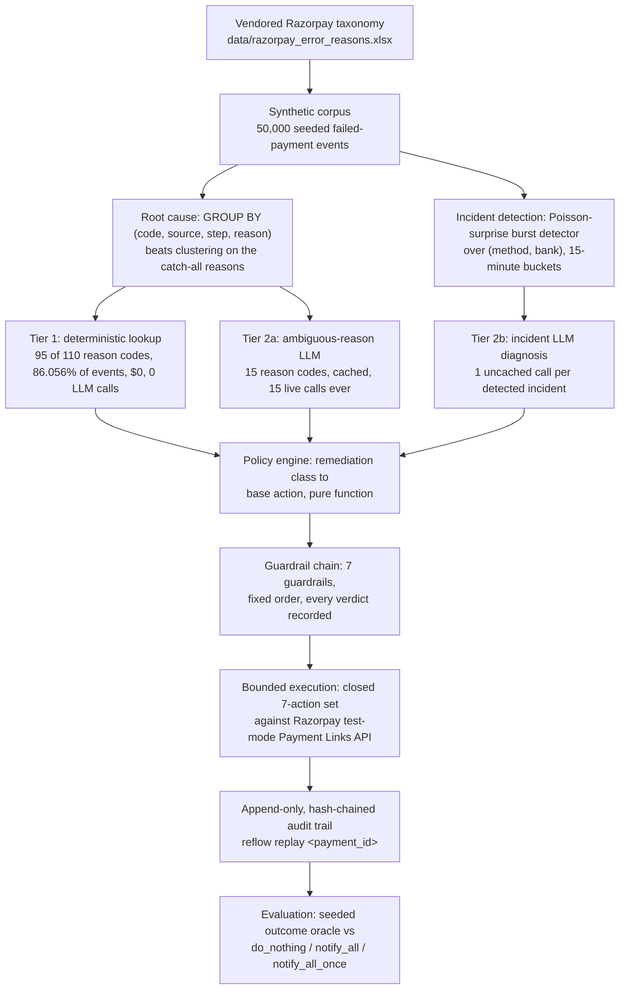

# reflow

**When Razorpay won't say why a payment failed, reflow infers it from when and where —
then decides whether chasing the customer is even worth doing.**

## The problem

Merchants lose real revenue to failed payments. The standard fix is blanket messaging:
send every failed customer a retry link, regardless of cause. That over-contacts people
and cannot tell a wrong PIN from a bank-wide outage — the two situations call for
opposite responses, and a blanket rule gives them the same one.

## The result

| policy | money recovered | contacts sent | contacts / ₹ recovered |
| --- | --- | --- | --- |
| `do_nothing` | ₹22,584,778 | 0 | 0.000000 |
| `notify_all` (blanket messaging) | ₹75,677,051 | 47,192 | 0.000624 |
| `notify_all_once` | ₹72,722,654 | 44,674 | 0.000614 |
| **`reflow`** | **₹71,874,179** | **33,691** | **0.000469** |

**reflow recovers less absolute money than blanket messaging, on purpose.** It recovers
95.0% of `notify_all`'s money (98.8% of the more realistic, single-shot
`notify_all_once`) while sending 28.6% fewer contacts. A system whose guardrails can
refuse to act — during quiet hours, below an amount floor, against a customer already
contacted enough, while a rail is a known outage — will always recover less absolute
money than a policy that never refuses. That holds at every point of a three-way
sensitivity band built specifically to stress it (pessimistic 96.1%, central 95.0%,
optimistic 97.1% of `notify_all`'s money), and it is reported as a loss, not reframed.
The claim is comparable recovery at materially lower contact cost, not a win on rupees.
Full band, the guardrails' measured cost, and every number's source:
[`docs/results.md`](docs/results.md).

## Try it in 30 seconds

```sh
uv sync
uv run reflow demo
```

No credentials, no network call, and no LLM call happen anywhere in that command.
`reflow demo` narrates this project's whole arc — corpus, root-causing, incident
detection, diagnosis, guardrails, execution, and the evaluation above — entirely from
already-committed report artefacts under `docs/reports/`. Pass `--fast` to skip the
~3-minute narrated pacing and print everything immediately. Every other command in this
README needs nothing more than `uv sync`, except the two marked **(live LLM)** in
[`docs/results.md`](docs/results.md#reproduce-every-number) (already run once, for real
money; their output is what is committed).

## How it works



A failed payment's own webhook already carries a structured `(code, source, step,
reason)` — `GROUP BY` on those fields root-causes it for free. A bank or rail outage is
found the same evidence-first way: not by reading any event's text, but by watching
failure counts over `(method, bank)` and time for a statistically surprising burst. Only
where structure genuinely runs out — 15 ambiguously worded reason codes, and the events
inside a detected incident — does a diagnosis touch an LLM, cached, never re-asked.

Every diagnosis becomes a candidate action, then passes through a fixed chain of seven
guardrails before anything is sent:


The most interesting thing this system does is **refuse** to act. On the 50,000-event
corpus, `ActiveIncidentGuardrail` alone redirected 7,372 events (14.7%) to
`WAIT_BANK_RECOVERY` — the size of "deliberately not chasing a customer while the rail
itself is down." Every guardrail's verdict, pass or block, is written to an append-only,
hash-chained audit trail; `reflow replay <payment_id>` reconstructs any single payment's
full decision from nothing else. Both diagrams are also committed standalone under
[`docs/diagrams/`](docs/diagrams), verified to parse as valid Mermaid `flowchart-v2`
source with the real `mermaid` npm package's own `mermaid.parse()`, not eyeballed.

## What we found

**The structured field already had the answer.** Three real clusterers (Drain3,
normalised template hashing, TF-IDF+HDBSCAN) were benchmarked against a trivial
`GROUP BY (code, source, step, reason)`, on exactly the catch-all reason codes where free
text is the only thing left to discriminate on. Under the condition Razorpay's own
documentation says actually holds in production — that it does not receive the
sub-cause behind `card_declined`, `payment_declined`, or `payment_failed` at all — every
candidate converged on `GROUP BY` or fell below it:

| candidate | catch-all ARI | vs. `GROUP BY`'s 0.325 |
| --- | --- | --- |
| `GROUP BY` (baseline) | 0.325 | — |
| Normalised template hashing | 0.325 | tied within noise (±0.005) |
| TF-IDF + HDBSCAN | 0.325 | tied within noise (±0.005) |
| Drain3 | 0.311 | below baseline (no signal to find) |

No clustering candidate is used anywhere in reflow's production root-causing path.
`GROUP BY` is. Full sweep, decision, and rejection reasons: `docs/design.md` ADR-0002.

**An LLM is confined to 15 of 110 reason codes.** Of 50,000 corpus events, 43,028
(86.056%) resolve through a plain deterministic table lookup — $0, zero latency, zero
non-determinism. The rest carry one of 15 genuinely ambiguous reason codes, escalated to
a cached LLM call: 15 calls, ever, regardless of corpus size. Incident-level diagnosis
adds one uncached call per detected incident (113 for this corpus). Total LLM calls
across the entire 50,000-event run: 128, not 50,000. Decision boundary: `docs/design.md`
ADR-0004.

**The guardrails' cost is measured, not hand-waved.** Suppressing a chase attempt
sometimes means walking away from money that would, in fact, have come back. For every
decision a guardrail redirected away from an escalatable action, the same payment
attempt's same deterministic oracle draw was also scored against the pre-guardrail
candidate. At the central estimate, reflow's guardrails walked away from **1,552
recoveries**, and **1,487 orders (3.3%)** never recovered by any other path in the
simulation as a direct result — the named, quantified price of reflow's lower contact
volume. Full band and source: [`docs/results.md`](docs/results.md).

## Prior art

A reviewer's first reaction may reasonably be "Razorpay already ships this." Razorpay's
own Agent Studio ships a Subscription Recovery Agent and two Abandoned Cart Conversion
Agents, and the Failed Payment Recovery dashboard feature sends a message on payment
failure. Both are, by design, a blanket rule — on failure, send a link — which is exactly
this project's `notify_all` baseline above, the one reflow measures itself against and
loses to on absolute rupees, honestly. What reflow adds is a different layer underneath
that rule: root-causing before acting, refusing to act during a live outage, and
recording every guardrail decision — pass or block — in a replayable trail. Full
comparison, and why the Razorpay MCP server was evaluated and not adopted:
[`docs/results.md`](docs/results.md#prior-art-in-full).

## Honest limits

Every "money recovered" figure here is scored by a seeded, deterministic oracle
(`reflow.outcome.oracle.RecoveryOracle`), never observed from a real customer or a live
Razorpay call — Razorpay's test mode exposes only a binary force-success/force-failure
toggle, never a probability, so a realistic outcome model can only be assumed, honestly
and on the record, or not built at all. Fourteen further things this system could not
resolve, each with its own mechanism, are listed in
[`docs/reports/phase7_evaluation.md`](docs/reports/phase7_evaluation.md#what-the-system-could-not-resolve-and-why) —
among them: three catch-all reasons Razorpay itself never receives the sub-cause for, a
`SWITCH_METHOD` restriction that cannot be mechanically confirmed to render on a real
checkout page, and the 1,487-order guardrail cost above.

## Why this exists

This was built for Razorpay's AI Buildathon, Track 3 (AI Revenue Recovery), whose brief
asked for money recovered measured across a batch, compliant escalation, stopping rules,
and an audit trail. Those four requirements shaped the architecture directly:

| Track 3 requirement | Delivered as |
| --- | --- |
| Money recovered, measured across a batch | Closed-loop simulation against three baselines — [`docs/results.md`](docs/results.md) |
| Compliant escalation | Seven-guardrail chain plus an attempt-driven escalation ladder — [ADR-0005](docs/design.md#adr-0005-a-closed-seven-action-set-a-sequential-guardrail-chain-and-an-attempt-number-driven-escalation-ladder) |
| Stopping rules | Attempt cap, contact cap, cooldown, quiet hours — every give-up explicit, none a silent fall-through — [ADR-0005](docs/design.md#adr-0005-a-closed-seven-action-set-a-sequential-guardrail-chain-and-an-attempt-number-driven-escalation-ladder) |
| Audit trail | Append-only, hash-chained, replayable per payment — [ADR-0006](docs/design.md#adr-0006-idempotency-by-catch-and-recover-not-by-header-an-append-only-hash-chained-audit-trail) |

## Going deeper

- **`docs/results.md`** — the full sensitivity band, the complete reproduce table, every
  finding in full detail, and the complete prior-art comparison.
- **`docs/design.md`** — every architectural decision as an ADR: context, evidence,
  decision, and the alternatives rejected along the way.
- **`docs/reports/`** — the raw, committed output of every benchmark and simulation this
  project ran. Every number anywhere in this documentation traces back to here.
- **`docs/diagrams/`** — the two Mermaid diagrams' standalone source files.
- **`BUILD_LOG.md`** — a dated, as-written record of what actually broke during
  development and what changed as a result.
- **`CLAUDE.md`** — the standing contract this repository is built to, including the two
  rules that govern every decision above: results are never fitted to a headline, and
  design is written down and justified before code.

### Architecture Decision Records

| ADR | Decision |
| --- | --- |
| [ADR-0001](docs/design.md#adr-0001-mypy-blocks-ci-ty-is-advisory-only) | `mypy` blocks CI; Astral's pre-1.0 `ty` runs advisory-only, never blocking. |
| [ADR-0002](docs/design.md#adr-0002-group-by-not-clustering-is-the-production-catch-all-root-cause-path) | `GROUP BY (code, source, step, reason)`, not clustering, is the production root-cause path — three real clusterers benchmarked and rejected. |
| [ADR-0003](docs/design.md#adr-0003-poisson-surprise-not-the-naive-threshold-is-the-recommended-incident-detector----despite-the-naive-threshold-mechanically-winning) | Poisson-surprise, not the naive fixed-threshold detector that mechanically "won" the pre-committed selection rule, is recommended for production incident detection. |
| [ADR-0004](docs/design.md#adr-0004-an-llm-is-invoked-at-exactly-two-boundaries-and-nowhere-structure-already-resolves-it) | An LLM is invoked at exactly two boundaries — 15 ambiguous reason codes (cached) and one call per detected incident — and nowhere else. |
| [ADR-0005](docs/design.md#adr-0005-a-closed-seven-action-set-a-sequential-guardrail-chain-and-an-attempt-number-driven-escalation-ladder) | A closed seven-action set, a sequential seven-guardrail chain in fixed order, and an attempt-number-driven escalation ladder. |
| [ADR-0006](docs/design.md#adr-0006-idempotency-by-catch-and-recover-not-by-header-an-append-only-hash-chained-audit-trail) | Idempotency by catch-and-recover (not a header, verified live to not exist), and an append-only, hash-chained audit trail. |
| [ADR-0007](docs/design.md#adr-0007-a-seeded-outcome-oracle-grounded-in-remediation-class-a-sensitivity-band-instead-of-a-point-estimate-and-a-model-default-chosen-on-measured-costlatencyreliability-evidence) | A seeded outcome oracle grounded in remediation class, a three-point sensitivity band, and `deepseek/deepseek-v4-flash` chosen as Tier 2's default on measured cost/latency/reliability evidence. |
| [ADR-0008](docs/design.md#adr-0008-accessibility-by-structural-construction-not-a-browser-based-audit) | Accessibility built into the HTML report's generation directly, verified by a real structural/contrast validator, not a browser-based `axe-core` audit. |

### Verification

```sh
uv sync --locked
uv run ruff check .
uv run ruff format --check .
uv run mypy .
uv run pytest --cov --cov-report=term-missing
```

CI (`.github/workflows/ci.yml`) runs exactly this, plus `uv run ty check .` (advisory
only, per ADR-0001), on a Python 3.11 + 3.13 matrix, on every push and pull request.
**866 tests, 99.65% branch coverage** (floor: 90%) on both interpreters, verified
strictly sequentially per this project's own `.venv`-corruption finding
(`BUILD_LOG.md`, 2026-08-23).
