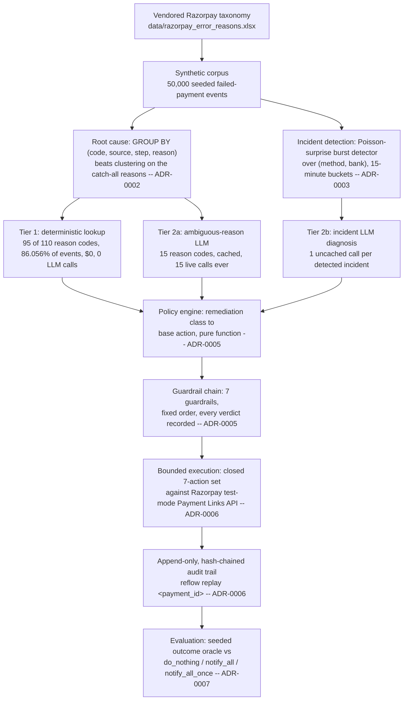
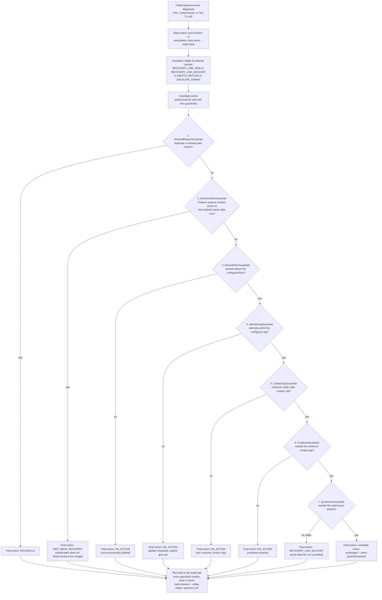

# reflow

An agent that root-causes failed Razorpay payments, detects live bank/rail outages,
diagnoses each failure through a deterministic-first/LLM-escalation split, picks a
bounded, guardrailed recovery action, executes it against Razorpay's test-mode APIs, and
reports measured, simulated recovery against baselines with every decision preserved in
an append-only, replayable audit trail.

## The headline, stated plainly

**reflow recovers ₹71.87M against blanket spam's ₹75.68M — 95.0% of the money, at 71.4%
of the customer contact (28.6% fewer messages sent).** This holds at every point of a
three-way sensitivity band built specifically to stress-test it (pessimistic 96.1%,
central 95.0%, optimistic 97.1% of the spam baseline's money).

Say the quiet part out loud: **reflow recovers less absolute money than a policy that
messages every failed customer forever, with no guardrail of any kind.** That is true at
every point this project checked, and it is reported as a loss, not reframed as a win. A
system whose guardrails can refuse to act — during quiet hours, below an amount floor,
against a customer already contacted enough, while a rail is a known outage, against a
duplicate or already-settled case — will, on any reasonable model of customer behaviour,
recover less absolute money than a policy that never refuses. That is not a bug in the
measurement; it is the mechanical, expected cost of the guardrails doing their job. The
honest claim this project makes is **comparable recovery at materially lower customer
contact cost, robust across the whole plausible range** — not a win on absolute rupees.
See [`docs/reports/phase7_evaluation.md`](docs/reports/phase7_evaluation.md) for the full
honesty statement this claim rests on.

| policy | money recovered | contacts sent | contacts / ₹ recovered |
| --- | --- | --- | --- |
| `do_nothing` | ₹22,584,778 | 0 | 0.000000 |
| `notify_all` (blanket spam) | ₹75,677,051 | 47,192 | 0.000624 |
| `notify_all_once` | ₹72,722,654 | 44,674 | 0.000614 |
| **`reflow`** | **₹71,874,179** | **33,691** | **0.000469** |

Central-sensitivity band, `uv run python -m reflow.eval.simulate`, full detail in
[`docs/reports/phase7_simulation.md`](docs/reports/phase7_simulation.md).

## Quickstart

```sh
uv sync
uv run reflow demo
```

That is it. **No credentials, no network call, and no LLM call happen anywhere in that
command.** `reflow demo` narrates this project's whole arc — corpus, root-causing,
incident detection, diagnosis, guardrails, execution, and the honest evaluation above —
entirely from already-committed report artefacts under `docs/reports/`. It is the single
strongest thing a reviewer can run in the next thirty seconds: no `.env`, no OpenRouter
key, no Razorpay key, no internet connection. Pass `--fast` to skip the ~3-minute narrated
pacing and print everything immediately (the same content, faster).

Every other command in this README needs nothing more than `uv sync` either, except the
two explicitly marked as live-LLM commands (which were already run once, for real money,
and their output is what is committed under `docs/reports/`).

## Architecture



Every package under `src/reflow` is named for the phase that built it and the ADR that
justifies it: `corpus`/`taxonomy` (label space and synthetic data), `signature`/`cluster`
(the clustering bake-off, ADR-0002), `incident` (burst detection, ADR-0003), `diagnose`
(two-tier diagnosis, ADR-0004), `policy` (actions, guardrails, ladder, ADR-0005),
`execute` (bounded execution against Razorpay test mode, ADR-0006), `audit` (the trail,
ADR-0006), `outcome` (the seeded oracle, ADR-0007), `eval` (every benchmark harness), and
`report` (the accessible HTML report, ADR-0008).

### How a single payment is decided

The most interesting thing this system does is **refuse** to act. This is where
`WAIT_BANK_RECOVERY` comes from, and it is not a special case bolted on afterward — it is
one guardrail firing, in a fixed, documented, sequential chain, with the reason recorded
in the audit trail whether it blocks or passes:



On the 50,000-event corpus, `ActiveIncidentGuardrail` alone redirected 7,372 events
(14.7%) to `WAIT_BANK_RECOVERY` — the concrete size of "the agent deliberately choosing
not to chase a customer while the rail itself is down." Both Mermaid sources are also
committed standalone under [`docs/diagrams/`](docs/diagrams) and were verified to parse
as valid `flowchart-v2` diagrams using the real `mermaid` npm package's own
`mermaid.parse()`, not eyeballed.

## What was measured, including what lost

Razorpay's own stated judging bar for this track is reported as: **"if you force an LLM
into a problem that a simple rule-based system would solve better, you will be marked
down."** This project's answer to that bar is not a design choice argued in the abstract —
it is a benchmark we ran against our own preferred approach, where it lost, and we
reported it.

### The clustering survey: the structured field already had the answer

Several clustering approaches were surveyed; three real clusterers (Drain3, normalised
template hashing, TF-IDF+HDBSCAN) were implemented and benchmarked against the trivial
`GROUP BY (code, source, step, reason)` baseline, on the catch-all reason codes where free
text is the *only* thing left to discriminate on. Under the condition Razorpay's own
vendored documentation says actually holds in production — that Razorpay does not receive
the sub-cause behind `card_declined`, `payment_declined`, or `payment_failed` at all —
there is no sub-cause signal in the text for any of them to find, so every candidate
converges on the baseline or falls below it:

| candidate | opaque-arm ARI (catch-all) | vs. `GROUP BY`'s 0.325 |
| --- | --- | --- |
| `GROUP BY` (baseline) | 0.325 | — |
| Normalised template hashing | 0.325 | tied within noise (±0.005) |
| TF-IDF + HDBSCAN | 0.325 | tied within noise (±0.005) |
| **Drain3** | **0.311** | **below baseline (no signal to find)** |

Full sweep across richness levels 1/3/5 and both arms:
[`docs/reports/phase2_clustering_bakeoff.md`](docs/reports/phase2_clustering_bakeoff.md);
decision and rejection reasons: `docs/design.md` ADR-0002. This is not a hedge — it is the
production decision. No clustering candidate is adopted anywhere in reflow's production
root-causing path. `GROUP BY` is.

### The routing split: 86.056% of events never touch an LLM

Of 50,000 corpus events, 43,028 (**86.056%**) resolve through a plain deterministic table
lookup, $0 cost, zero latency, zero non-determinism. The other 13.944% carry one of 15
genuinely ambiguous reason codes, escalated to a cached LLM call — 15 calls, ever,
regardless of corpus size. Incident-level diagnosis adds one uncached LLM call per
detected incident (113 for this corpus). **Total LLM calls across the entire 50,000-event
run: 128** (15 + 113) — not 50,000, and not 6,972. Full routing detail and per-call cost:
[`docs/reports/phase4_diagnosis.md`](docs/reports/phase4_diagnosis.md); the boundary
decision (exactly where an LLM is used and where it is deliberately not): `docs/design.md`
ADR-0004.

### Incident detection: `GROUP BY reason` fragments what temporal correlation catches whole

All 50 of 50 ground-truth downtime windows in the corpus span 3-4 distinct reason codes at
once — a single bank outage, several different-looking failure buckets. A per-reason-code
`GROUP BY` view — even given the *winning* detector's own algorithm, run at the finest
granularity a naive per-reason monitor could have — never misses most of an incident's
events, but it fragments **each single incident into 3.74 (train) to 4.62 (test) separate
alerts on average, 100% of the time**, roughly 100-150x slower to compute than the
entity-level view. The recommended production detector, `poisson_surprise` over `(method,
bank)`, sees each incident as one incident. Full results:
[`docs/reports/phase3_incident_detection.md`](docs/reports/phase3_incident_detection.md);
decision: `docs/design.md` ADR-0003.

## The honesty section

**Every "money recovered" number in this README and in `docs/reports/phase7_*` is scored
by a seeded, deterministic oracle (`reflow.outcome.oracle.RecoveryOracle`), never observed
from a real customer or a live Razorpay call.** Razorpay's test mode exposes only a binary
force-success/force-failure toggle per payment, never a probability — there is no sandbox
surface that answers "does a fresh Payment Link recover a `card_declined` failure 40% of
the time or 60%." That number can only be assumed, honestly and on the record, or not
measured at all. The oracle assumes it, in the open: two free parameters per
`RemediationClass` (ten classes, twenty numbers total, never one per reason code and never
one per action), grounded in the same vendored `Next Steps` text ADR-0002 and ADR-0004
already classified by hand — never tuned after seeing a simulation result. Every headline
number is checked across a three-point sensitivity band (pessimistic/central/optimistic)
specifically so no single assumed probability carries the conclusion. Full statement:
[`docs/reports/phase7_evaluation.md`](docs/reports/phase7_evaluation.md#honesty-statement-read-this-before-any-number-below).

### The guardrails' cost, measured, not hand-waved

Suppressing a chase attempt sometimes means walking away from money that would, in fact,
have come back. This was measured directly rather than left implicit: for every reflow
decision a guardrail redirected away from an escalatable action, the same payment
attempt's same deterministic oracle draw was also scored against the pre-guardrail
candidate action.

| sensitivity | guardrail-blocked events | would have recovered per oracle | orders never recovered by any other path |
| --- | --- | --- | --- |
| pessimistic | 10,148 | 968 (9.5%) | 937 |
| **central** | **9,992** | **1,552 (15.5%)** | **1,487 (3.3% of 44,674 orders)** |
| optimistic | 9,848 | 1,866 (18.9%) | 1,766 |

At the central estimate, reflow's guardrails walked away from **1,552 recoveries** and
**1,487 orders (3.3%)** never recovered by any other path in the simulation as a direct
result. This is the named, quantified price of reflow's lower contact volume — not folded
into an aggregate. Source: `docs/reports/phase7_evaluation.md`, "The measured cost of
reflow's guardrails" section (a one-off, read-only analysis built from existing
`reflow.outcome.oracle`/`reflow.policy` APIs, not yet a committed, tested module — see
ADR-0007's consequences for the plan to promote it).

### What the system could not resolve, and why (14 items, condensed)

Full detail, each with its own mechanism and citation, in
[`docs/reports/phase7_evaluation.md`](docs/reports/phase7_evaluation.md#what-the-system-could-not-resolve-and-why):

1. 15 reason codes with genuinely ambiguous or self-contradictory vendored text.
2. 3 catch-all reasons (`card_declined`, `payment_declined`, `payment_failed`) whose true
   sub-cause Razorpay itself never receives — an LLM cannot see what was never sent.
3. 2 of 15 ambiguous-reason diagnoses independently flagged overconfident by a
   different-model-family judge.
4. 4 of 113 sampled incident diagnoses also flagged overconfident.
5. The escalation ladder gave up (`AttemptCapGuardrail`) on 4 of 50,000 events.
6. 9,992 guardrail-suppressed contacts (central estimate), 1,487 orders' worth never
   recovered by any other path — the most consequential item on this list.
7. `SWITCH_METHOD`'s method restriction cannot be mechanically confirmed to render on the
   real checkout page (would need a real browser; out of scope for this harness).
8. `DIFFERENT_INSTRUMENT`-classified reasons cannot get a true instrument-level block —
   Razorpay's API restricts by whole method, never by specific card or VPA.
9. The committed audit trail is a bounded, 503-record sample, not the full 50,000-decision
   corpus (the full trail is supported in code, just not the artefact committed here).
10. 1 of 8 correlatable detected incidents can never be corroborated against Razorpay's
    own Downtime API, which only declares downtime for Card, Netbanking, and UPI.
11. No burst detector here has change-point memory; a long outage inflates its own
    trailing-rate baseline over time.
12. The recovery oracle assumes independence across an order's repeated attempts — no
    decay/improvement modelled, deliberately, to avoid inventing an ungrounded parameter.
13. Quiet hours (21:00-09:00) is a configurable policy default, not a cited TRAI/TCCCPR
    legal threshold — stated plainly rather than fabricating a citation.
14. Duplicate-`reference_id` recovery matches the Razorpay SDK's exception *message
    string*, since the SDK exposes nothing more structured; a future wording change could
    silently stop it from firing.

## Prior art, addressed head-on

A reviewer's first reaction may reasonably be "Razorpay already ships this." Two real
products are worth naming, fairly:

- **Agent Studio** (launched at FTX'26, built on Anthropic's Claude Agent SDK) ships a
  **Subscription Recovery Agent** and two **Abandoned Cart Conversion Agents**. These are
  genuinely capable, production products.
- The **Failed Payment Recovery** dashboard feature sends a recovery message on payment
  failure, citing Razorpay's own figure that "20-25% of payments fail due to avoidable
  reasons, and half of those customers wouldn't return without a nudge."

Both are, by design, a **blanket rule: on failure, send a link.** That rule is exactly
this project's `notify_all` baseline — the one reflow measures itself against and loses to
on absolute rupees, honestly, above. What reflow adds is not a better version of the same
idea; it is a different layer underneath it:

- **reflow root-causes before acting** — `GROUP BY (code, source, step, reason)`, not free
  text, not a guess (ADR-0002), then a two-tier deterministic/LLM diagnosis that touches an
  LLM on 13.944% of events, cached down to 128 total calls for 50,000 events (ADR-0004).
- **reflow refuses to act during a live outage** — 7,372 times on this corpus, via
  Poisson-surprise incident detection over `(method, bank)`, not by reading event text
  (ADR-0003), rather than messaging a customer about a rail failure that is not their
  fault and that a fresh link cannot fix.
- **Every guardrail decision is recorded, including every pass, not just every block** —
  an append-only, hash-chained audit trail, replayable per payment with `reflow replay
  <payment_id>` (ADR-0006).
- **reflow reports that it recovers less money than blanket spam**, honestly, across a
  full sensitivity band, rather than presenting only the comparison that flatters it.

**The Razorpay MCP server was evaluated and not adopted.** Its tool surface
([`razorpay/razorpay-mcp-server`](https://github.com/razorpay/razorpay-mcp-server)) covers
payments, orders, refunds, payment links, settlements, and QR codes — but has no
failure-reason or retry tool, because no such capability exists on Razorpay's API surface
at all (verified directly against the Payments API, `BUILD_LOG.md`, 2026-09-01). reflow
talks to Razorpay's REST API and webhook payloads directly for the same reason.

## How to reproduce every number

Every command below is deterministic (seed `20260822`) and reproduces the exact committed
report. The two marked **(live LLM)** cost real money when they were originally run —
their output is already committed; you do not need to re-run them to see the numbers, and
running them again will make new, real OpenRouter calls.

| Claim | Command | Report |
| --- | --- | --- |
| ₹71.87M vs ₹75.68M, 95.0% at 71.4% contact, sensitivity band | `uv run python -m reflow.eval.simulate` | `docs/reports/phase7_simulation.{json,md}` |
| Guardrail cost: 1,552 recoveries, 1,487 orders (3.3%) | ad hoc script over `reflow.outcome.oracle`/`reflow.policy` (see ADR-0007) | `docs/reports/phase7_evaluation.md` |
| Clustering bake-off: 3 clusterers vs `GROUP BY` | `uv run python -m reflow.eval.clustering` | `docs/reports/phase2_clustering_bakeoff.{json,md}` |
| Incident detection: fragmentation, downtime correlation | `uv run python -m reflow.eval.incident` | `docs/reports/phase3_incident_detection.{json,md}` |
| Routing split: 86.056%, 128 LLM calls **(live LLM)** | `uv run --env-file .env python -m reflow.eval.diagnose` | `docs/reports/phase4_diagnosis.{json,md}` |
| Model default (deepseek, ~35x cheaper) **(live LLM)** | `uv run --env-file .env python -m reflow.eval.model_compare` | `docs/reports/phase7_model_comparison.{json,md}` |
| Guardrail chain fire counts, action distribution | `uv run python -m reflow.eval.policy` | `docs/reports/phase5_policy.{json,md}` |
| Bounded execution, idempotency check, audit trail | `uv run python -m reflow.eval.execute` (dry-run, $0) | `docs/reports/phase6_execution.{json,md}`, `docs/reports/phase6_audit_trail.jsonl` |
| Replay one payment's full decision chain | `uv run reflow replay <payment_id>` | reads the audit trail directly |
| Accessible HTML report, structural/contrast validation | `uv run python -m reflow.report` | `docs/reports/phase8_report.html` |
| Full pipeline demo, no creds/network/LLM | `uv run reflow demo` (`--fast` for instant output) | narrates the reports above |
| Test suite, coverage floor, both interpreters | `uv run pytest --cov --cov-report=term-missing` | CI: `.github/workflows/ci.yml`, matrix 3.11 + 3.13 |

## Architecture Decision Records

Full text, evidence, and rejected alternatives for every decision: `docs/design.md`.

| ADR | Decision |
| --- | --- |
| [ADR-0001](docs/design.md#adr-0001-mypy-blocks-ci-ty-is-advisory-only) | `mypy` blocks CI; Astral's pre-1.0 `ty` runs advisory-only, never blocking. |
| [ADR-0002](docs/design.md#adr-0002-group-by-not-clustering-is-the-production-catch-all-root-cause-path) | `GROUP BY (code, source, step, reason)`, not clustering, is the production root-cause path — three real clusterers benchmarked and rejected. |
| [ADR-0003](docs/design.md#adr-0003-poisson-surprise-not-the-naive-threshold-is-the-recommended-incident-detector----despite-the-naive-threshold-mechanically-winning) | Poisson-surprise, not the naive fixed-threshold detector that mechanically "won" the pre-committed selection rule, is recommended for production incident detection. |
| [ADR-0004](docs/design.md#adr-0004-an-llm-is-invoked-at-exactly-two-boundaries-and-nowhere-structure-already-resolves-it) | An LLM is invoked at exactly two boundaries — 15 ambiguous reason codes (cached) and one call per detected incident — and nowhere else. |
| [ADR-0005](docs/design.md#adr-0005-a-closed-seven-action-set-a-sequential-guardrail-chain-and-an-attempt-number-driven-escalation-ladder) | A closed seven-action set, a sequential seven-guardrail chain in fixed order, and an attempt-number-driven escalation ladder. |
| [ADR-0006](docs/design.md#adr-0006-idempotency-by-catch-and-recover-not-by-header-an-append-only-hash-chained-audit-trail) | Idempotency by catch-and-recover (not a header, verified live to not exist), and an append-only, hash-chained audit trail. |
| [ADR-0007](docs/design.md#adr-0007-a-seeded-outcome-oracle-grounded-in-remediation-class-a-sensitivity-band-instead-of-a-point-estimate-and-a-model-default-chosen-on-measured-costlatencyreliability-evidence) | A seeded outcome oracle grounded in remediation class, a three-point sensitivity band, and `deepseek/deepseek-v4-flash` chosen as Tier 2's default on measured cost/latency/reliability evidence. |
| [ADR-0008](docs/design.md#adr-0008-accessibility-by-structural-construction-not-a-browser-based-audit) | Accessibility built into the HTML report's generation directly, verified by a real structural/contrast validator, not a browser-based `axe-core` audit. |

`docs/design.md` also has an "External citations" section: Razorpay's own downtime-detection
engineering blog, the ADA anomaly platform, Optimizer, NPCI's OC-149 circular, RBI's TAT
circular (cited to mark a boundary reflow is deliberately *not* in), and Razorpay's own
"20-25% of payments fail due to avoidable reasons" figure — every claim sourced, and marked
primary or secondary.

## Documentation map

- **`README.md`** (this file) — the five-minute read.
- **`docs/design.md`** — every architectural decision as an ADR (context, evidence,
  decision, rejected alternatives, consequences), plus the same two Mermaid diagrams
  embedded (identical to `docs/diagrams/`), the external-citations section, and a "Known
  technical debt" section naming what an adversarial review of this codebase found and
  did not fix, with the reasoning either way — `eval/`'s seven independently-duplicated
  report generators, three stringly-typed report parsers where every other boundary uses
  `pydantic`, `policy` quietly sourcing 15 diagnoses from a committed evaluation artefact,
  and an inconsistent exception hierarchy across packages.
- **`docs/reports/`** — the raw, committed output of every benchmark and simulation this
  project ran, in matched `.json`/`.md` pairs, plus the accessible HTML pipeline report
  (`phase8_report.html`) and the sampled audit trail (`phase6_audit_trail.jsonl`). This is
  where every number in this README and in `docs/design.md` traces back to. There is no
  separate `docs/evaluation.md`: `docs/reports/phase7_evaluation.md` already is that
  document (honesty statement, headline comparison, guardrail cost, the 14-item exception
  list, model-default recommendation) — a second file would only duplicate it.
- **`docs/diagrams/`** — the two Mermaid diagrams' standalone source files.
- **`docs/style/README.md`** — the external style references this project's lint/format/
  docstring rules are built on.
- **`BUILD_LOG.md`** — a dated record of what actually broke during development, the
  evidence, and what changed as a result. Read this for the "why" behind decisions that
  are not architecturally significant enough for an ADR but were real, sometimes
  expensive, findings (a leaked test-mode credential, a silently-downgraded dependency, a
  CI-matrix-only failure).
- **`CLAUDE.md`** — the standing contract for any agent working in this repository: hard
  rules (no code comments, `uv run` everywhere, 90% branch-coverage floor, `mypy` blocks
  CI) and the two governing principles this whole project is built to honour: results are
  never fitted to a headline, and design is written down and justified before code.

## Verification

```sh
uv sync --locked
uv run ruff check .
uv run ruff format --check .
uv run mypy .
uv run pytest --cov --cov-report=term-missing
```

CI (`.github/workflows/ci.yml`) runs exactly this, plus `uv run ty check .` (advisory
only, per ADR-0001), on a Python 3.11 + 3.13 matrix, on every push and pull request.
**866 tests, 99.65% branch coverage** (floor: 90%) on both interpreters, verified
strictly sequentially per this project's own `.venv`-corruption finding
(`BUILD_LOG.md`, 2026-08-23).
